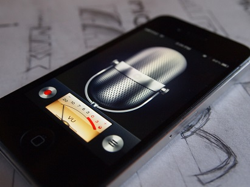

On Wednesday, the Illinois State Senate passed the Keep Internet Devices Safe Act, a bill that would ban manufacturers of devices that can record audio from doing so remotely without disclosing it to the customer. But after lobbying from trade associations that represent the interests of Google, Amazon, makers of the microphone-enabled Google Home and Alexa smart speakers, respectively, and Microsoft, among other companies, the interests of big tech won out... In its current, neutered form, the bill provides exclusive authority to the Attorney General to enforce the Act, which means regular citizens won't be able to bring forward a case regarding tech giants recording them in their homes.

[Ars Technica](https://arstechnica.com/tech-policy/2019/04/illinois-bill-banning-eavesdropping-by-iot-devices-defanged-by-tech-lobby/) notes the move comes after Amazon admitted thousands of their employees listen to Alexa recordings -- "something not mentioned in Echo's terms of service or FAQ pages."

Vice points out that sometimes those recordings are shared "even after users opt out of having their data used in the program."