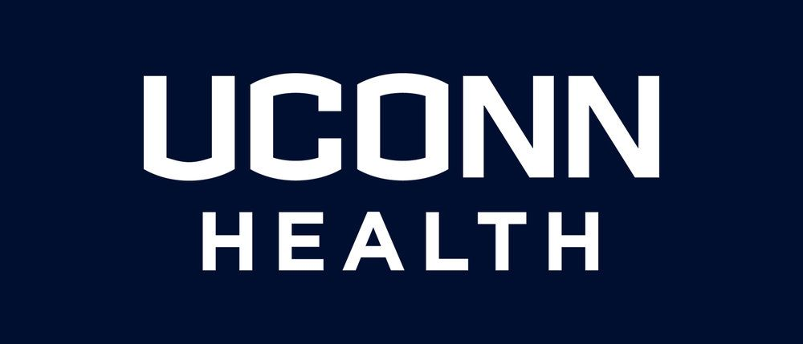

We recently discussed the breach at the [University of Washington health.](https://www.d3fcon.com/recent-breach-of-note/)   This time, we have another College affiliated hospital breach, UConn Health.

UConn self-reported that an unauthorized third party got access to some employee email accounts. The information obtained included Social Security numbers, birthdays, billing details and medical appointments. The breach affected as many as 326,000 individuals, and 1,500 of them may have involved Social Security numbers. It was also revealed that the source of the breach was a phishing attack but the perpetrator is still unidentified.

Upon finding out about the breach, UConn contacted law enforcement and hired a [forensic science firm](https://www.infosecusa.com/) to search for the personal information.  As expected, UConn sent notification letters to the victim.  Nice to get these letters saying that your information was compromised... Ooops, sorry!

Hey, on a positive note following another breach where your sensitive data is exposed and probably sold in the Onion network for years to come, you get.... wait for it... free credit monitoring from careless UConn.  Boo-Ya!!!