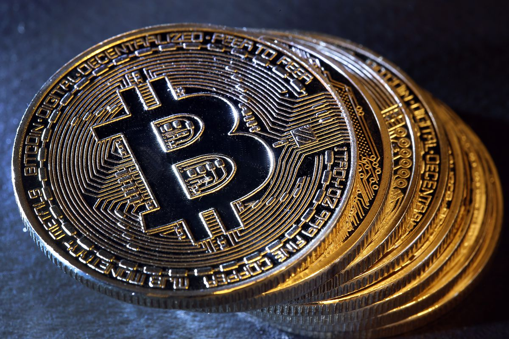

Hackers have [stolen over $40 million worth of bitcoin](https://techcrunch.com/2019/05/07/binance-breach/) from Binance, world's largest cryptocurrency exchanges, the company said on Tuesday. 

In a statement, the company said hackers stole API keys, two-factor codes and other information in the attack. Binance traced the cryptocurrency theft -- more than 7,000 bitcoins at the time of writing -- to a single wallet after the hackers stole the contents of the company's bitcoin hot wallet. Binance, the world's largest cryptocurrency exchange by volume, said the theft impacted about 2 percent of its total bitcoin holdings.

If this type of stuff gets your D3fcon level to rise, should you avoid Bicoin?  We don't recommend that extreme but you should check out getting a cold storage wallet with redundancies.