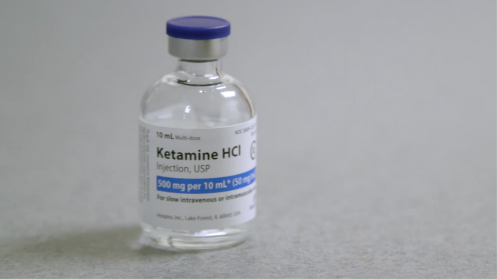

It has been more than 30 years since a new type of drug for treating depression has come to market. Most antidepressants have been based on the “monoamine hypothesis”, which holds that depression is caused by low levels of a class of chemical messengers (the monoamine neurotransmitters: serotonin, norepinephrine and dopamine) in the brain. Unfortunately, over a third of patients fail to respond to these drugs, and even when the drugs do work, it can take weeks or months for their effects to kick in.

The Food and Drug Administration (fda) in America that it had approved a new drug for patients with “treatment-resistant” depression, defined as having not responded adequately to at least two previous antidepressants. Of particular note is that it is based on ketamine, a recreational drug.  Problem is that this is a powerful hallucinogen.  The medical community has finally figured out that the way to not be sad is to be high! 