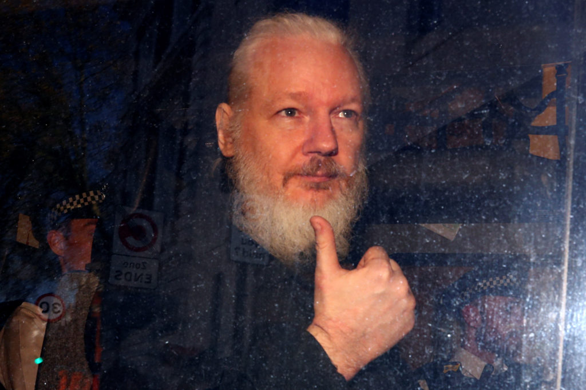

The BBC reports that Ecuador's foreign minister Jose Valencia has been sharing complaints about Julian Assange's conduct during his stay in Ecuador's embassy, for example, that Julian Assange damaged the facilities by riding his skateboard and playing football, despite being told not to do so.

Cleaning staff, Mr Valencia said, had described "improper hygienic conduct" throughout Assange's stay, an issue that a lawyer had attributed to "stomach problems". One unnamed senior Ecuadorean official told AP news agency that other issues included "weeks without a shower" and a "dental problem born of poor hygiene". Interior Minister Maria Paula Romo then complained that Assange had been allowed to do things like "put faeces on the walls of the embassy and other behaviours of that nature...."

Assange's stay at the embassy cost Ecuador some $6.5m (£5m) from 2012 to 2018, Mr Valencia said.

NPR reports that Julian Assange's cat also "arguably played a small role in Ecuador's decision to end its asylum agreement," citing remarks from Ecuador President Lenin Moreno:
Moreno explained that Assange treated his hosts disrespectfully; late last year the embassy implemented a series of rules for Assange, including a requirement to be responsible for the "well-being, food, hygiene and proper care of your pet." If Assange didn't, the embassy threatened to put the cat in a shelter. In other words, it is likely that Assange didn't effectively clean up after his cat's own wiki-leaks... 

The New Yorker reported in 2017 that Assange's interest in the cat was less as an animal lover and more as a master of his own brand. "Julian stared at the cat for about half an hour, trying to figure out how it could be useful, and then came up with this: Yeah, let's say it's from my children," the magazine quoted one of Assange's friends as saying. "For a time, he said it didn't have a name because there was a competition in Ecuador, with schoolchildren, on what to name him. Everything is P.R. -- everything."

Journalist James Ball, an early WikiLeaks employee (who left after three months) said Thursday on Twitter that he'd "genuinely offered to adopt" the cat -- but it was "reportedly given to a shelter by the Ecuadorian embassy ages ago."

Assange's legal team, however, tweeted in November that Assange had been outraged by embassy threats to send the cat to the pound, and asked his lawyers "to take his cat to safety. The cat is with Assange's family. They will be reunited in freedom."