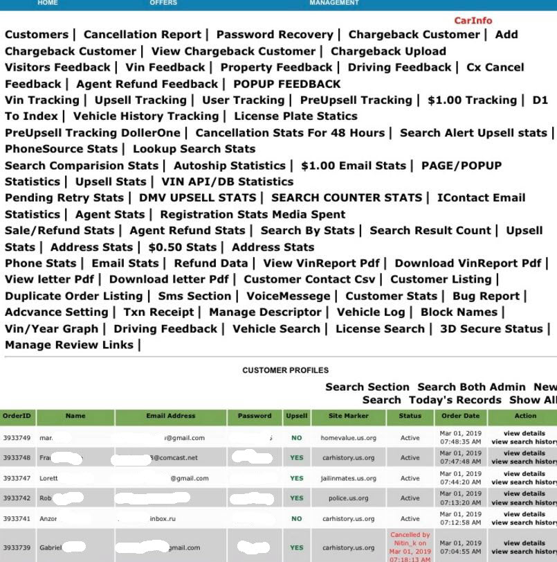

Online criminals are selling access to customer information stolen from online  bait-and-switch Web sites that sell access to data on U.S. consumers. According to Krebs on Security, a Dark Web forum posted an auction notice for access to a Web-based administrative panel for an unidentified “US Search center” that he claimed holds some four million customer records, including names, email addresses, passwords and phone numbers. The starting bid price  was $800.

Several screen shots shared by the seller suggested the customers in question had all purchased subscriptions to a variety of sites that aggregate and sell public records, such as dmv.us.org, carhistory.us.org, police.us.org, and criminalrecords.us.org.

It appears that people who were enticed to pay for reports generated by these services later complained that although the sites advertised access for just $1, they were soon hit with a series of much larger charges on their credit cards.  The man behind the scam appears to be 
Jesse Willms, a man The Atlantic magazine described in an unflattering January 2014 profile as “The Dark Lord of the Internet”

In case it is useful for others, KrebsOnSecurity is also publishing the results of several reverse WHOIS lookups for historic domains tied to the scam:

Reverse WHOIS on Peter Graver and Jesse Willms (rickholl2k9@gmail.com)

Reverse WHOIS on mike@tmgbox.com

Reverse WHOIS on Jason Oster (joster2008@gmail.com)

Public records search domains associated with Terra Marketing Group and Penguin Marketing:

memberreportaccess.com
publicrecords.us.org
dmvrecords.co
dmv.us.org
courtrecords.us.org
myfeeplan.com
police.us.org
warrantcheck.com
myinfobill.com
propertysearch.us.org
homevalue.us.org
carinfo2.com
backgroundchecks.us.org
arrestrecords.us.org
propertyrecord.com
criminalrecords.us.org
jailinmates.us.org
vehiclereportusa.com
dmvinfocheck.com
carrecordusa.com
carhistoryindex.com
autohistorychecks.com
mugshots.us.org
trafficticket.us.org
prison.us.org
reversephonelookup.us.org
deathrecords.us.org
deathrecord.com
deathcertificates.us.org
census.us.org
phonelookup.us.org
vehiclehistoryreports.us.org
vinsearchusa.org

---
