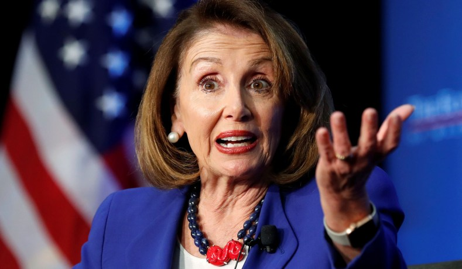

Here we go again with Nancy Pelosi's weird comments.  The top US Congressman Says Silicon Valley's Self-Regulating Days 'Probably Should Be' Over . On the technology podcast Recode Decode, America's Speaker of the House, Democrat Nancy Pelosi, said that Silicon Valley's self-regulating days "probably should be" over. Recode reports: Pelosi said Silicon Valley is abusing the privilege of section 230 of the Communications Decency Act, which says that internet companies are not responsible for what is posted on their platforms. "230 is a gift to them, and I don't think they are treating it with the respect that they should," she said. "And so I think that that could be a question mark and in jeopardy.... For the privilege of 230, there has to be a bigger sense of responsibility on it, and it is not out of the question that that could be removed."

Asked about Democratic presidential candidate Elizabeth Warren's proposal to break up Amazon, Google, and Facebook, Pelosi said she had not studied it closely. Instead, she more cautiously suggested that some agglomerations of power may be worth breaking up. "I know there could be some clear lines that we see in our community, of companies that maybe could be easily broken up without having any impact, one on the other," she said. "I'm a big believer in the antitrust laws, I think that's very important for us to have them and to use them, and to subject those who should be subjected to it. "