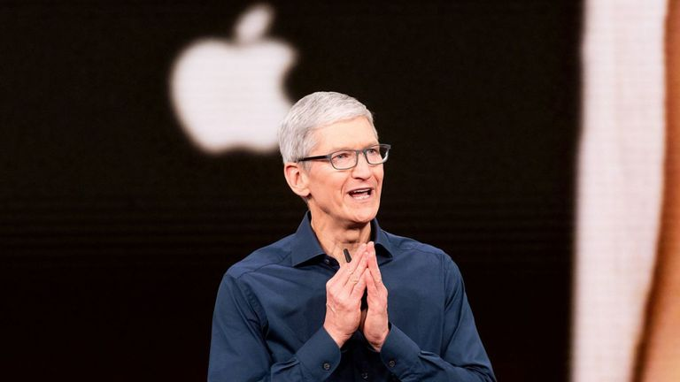

It's official, Tim Cook has turned into a tech socialist. In an interview at the TIME 100 Summit in New York, Apple CEO Tim Cook said [more government regulation on the tech industry is needed in order to protect privacy](http://time.com/5574143/technology-needs-to-be-regulated-says-apples-tim-cook/). 

"We all have to be intellectually honest, and we have to admit that what we're doing isn't working," said Cook. "Technology needs to be regulated. There are now too many examples where the no rails have resulted in a great damage to society." Time Magazine reports:  <i>In the interview, Cook suggested that U.S. regulators could look to Europe's passage of the General Data Protection Regulation (GDPR) in 2018. "GDPR isn't ideal," said Cook. "But GDPR is a step in the right direction." In light of recent data breaches and foreign election influence through social media, Cook's view is that the tech industry has no other responsible option but to accept more government oversight, a position he outlined in a recent TIME Ideas piece. 

"I'm hopeful," Cook said at the Summit. "We are advocating strongly for regulation -- I do not see another path." Cook also explained Apple's stance on transparency and money in politics. "We focus on policies, not politics," Cook said. "Apple doesn't have a PAC...I refuse to have one because it shouldn't exist." [...] "I try not to get wrapped up in a pretzel about who we upset," Cook said. "At the end of the day we'll be judged more on 'did we stand up for what we believed in,' not necessarily, 'do they agree with it.'"