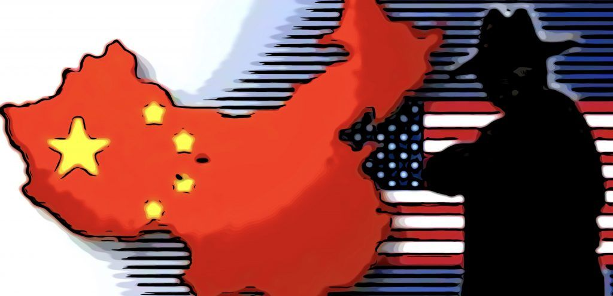

Recently, an [American spy was convicted of spying on the USA for China.](https://www.cyberforensics.tech/the-spy-case-of-kevin-patrick-mallory/) 

The case has some interesting discussion.  
##Train them to spy then act surprised when they take money to spy on YOU!

Defendant is a former CIA and Defense Intelligence Agency (DIA) operative and contractor. Between 1981 and 2012, defendant worked for various U.S. Government agencies and cleared defense contractors. He also served some time on active duty in the U.S. Army. After leaving his last position as a contractor, defendant, at the times relevant here, was self-employed, operating his own largely unsuccessful consulting business.

The majority of the trial evidence focused on defendant’s contacts and relationship with Michael Yang, a citizen of the PRC who defendant believed was an intelligence officer for the PRC intelligence service (PRCIS). In February 2017, a Chinese business recruiter named Richard Yang contacted defendant through LinkedIn, a social media website used for job networking. Richard Yang told defendant that he had leads about possible consulting work in the PRC. After defendant expressed an interest in this possible consulting work, Richard Yang arranged for defendant to contact an individual named Michael Yang. Defendant, who was in the United States, then engaged in a Skype call with Michael Yang, who was located in the PRC. The purpose of the call was to determine the nature of the information Michael Yang was seeking. In this Skype call, Michael Yang apparently described to defendant the nature of the information he, Michael Yang, was seeking. Defendant took notes on the topics in which Michael Yang had expressed an interest. The notes defendant made of the call reflect that Michael Yang was interested in the following: the United States’ THAAD2missile defense system, the South China Sea, currency manipulation by the PRC, and public-private partnerships, a subject that a government expert at trial testified could involve classified information/national defense information (NDI).

Following his initial Skype call with Michael Yang, defendant, in late February, contacted Ralph Stephenson (Stephenson), a person defendant knew from defendant’s church and who defendant also knew worked at the CIA. Defendant asked Stephenson to help him contact someone at the CIA working on China issues. Stephenson testified at trial that defendant’s contact made him uncomfortable and accordingly Stephenson reported defendant’s contacts with Stephenson to CIA security agents.

In early March 2017, defendant and Michael Yang arranged for defendant to travel to the PRC to meet with Michael Yang and Mr. Ding, putatively Michael Yang’s boss. In advance of the trip, defendant asked Michael Yang to provide defendant with an Apple iPhone for defendant to use to communicate with Michael Yang while defendant was in the PRC. Defendant asked Michael Yang to have WeChat, a communication application popular in the PRC, installed on the iPhone. Defendant requested that Michael Yang have the iPhone left in a sealed envelope in defendant’s hotel so that in defendant’s words defendant could be sure the iPhone “had not been tampered with.” 

The day following defendant’s email exchange with Michael Yang concerning defendant’s request for an iPhone, defendant went to a FedEx store in Washington D.C. where defendant had nine pages of documents scanned onto an SD card. These documents were unclassified and related to CIA analysis standards, military intelligence acronyms, and other topics. On March 13, 2017, after defendant arrived in Shanghai, China, defendant sent an email to Michael Yang attaching the nine pages of scanned documents from the SD card. As defendant put it, these attached nine pages were attached as “examples.” 

During this visit of defendant to the PRC, defendant met for several hours with Michael Yang and Mr. Ding. Defendant in his later interviews with CIA and FBI agents acknowledged that in the course of this visit to the PRC defendant understood that Michael Yang and Mr. Ding were in fact PRC intelligence officials seeking U.S. Government secrets.

In April 2017, defendant again traveled to the PRC. On this trip Michael Yang provided defendant with a Samsung Galaxy Note 4 smartphone, which defendant described as a covert communications (covcom) device. This covcom device included a custom application that allowed defendant to send encrypted communications to Michael Yang through WeChat, a program that was loaded on the covcom device. While defendant was in the PRC, Michael Yang trained defendant on how to use the covcom device to communicate securely with Michael Yang via encrypted messages.

Defendant then returned to the United States, landing first in Chicago. When asked about the covcom device, defendant falsely told CBP officers that the covcom device was a gift for his wife. The CBP officers allowed defendant to retain both the $16,500 and the covcom device, and then to return to his home in Leesburg, Virginia.

On April 25, 2017, defendant visited a FedEx store at a location near his home in Leesburg, Virginia. Footage from surveillance cameras at the FedEx store showed defendant handing a FedEx clerk nine stacks of documents to be scanned onto an SD card. The page count (47 pages) for the scanning job matched the total page count for eight documents and a handwritten table of contents later found on June 22, 2017 on two SD cards secreted in a junk drawer in defendant’s closet in his home in Leesburg. According to the government witness’s trial testimony these documents contained classified information/NDI. Among the documents defendant later transmitted to Michael Yang were a handwritten table of contents containing classified information/NDI, and an unclassified White Paper with two yellow pages of handwritten notes containing classified information/NDI. The surveillance footage at the FedEx store showed flashes of sheets of yellow paper being scanned which matched the notes accompanying the White Paper that defendant transmitted to Michael Yang. The FedEx receipt shows that defendant paid the FedEx clerk to shred all nine documents after they were scanned onto the SD card.

Expert testimony presented by the government shows that shortly before midnight on May 1, 2017 and just after midnight on May 2, 2017 defendant completed all the steps necessary to transmit to Michael Yang in the PRC via the covcom device the following documents: (i) handwritten table of contents describing the various documents defendant intended to send to Michael Yang, and (ii) the White Paper and handwritten notes. Both the table of contents and the White Paper contained classified information/NDI. Michael Yang acknowledged receipt of these documents and told defendant that Michael Yang’s boss was interested in the documents, but needed more detailed and complete documents relating to the PRC. Defendant told Michael Yang that he would send additional documents once defendant received reimbursement for his trip to the PRC and payment for the documents he had already sent.

The government also presented expert testimony that several days later on May 5, 2017 defendant completed the steps on the covcom device necessary to transmit to Michael Yang in the PRC two additional documents containing classified information/NDI. Although the evidence discloses that defendant succeeded in completing the steps necessary to transmit the classified information/NDI to Michael Yang in the PRC, the evidence does not disclose whether or not Michael Yang received these documents. After the attempted transmission of these documents, Michael Yang told defendant via the covcom device that defendant should hold off on sending more documents. Defendant and Michael Yang also discussed a possible third trip to the PRC in July 2017.

After these transmissions and attempted transmissions, defendant met with the CIA and FBI agents in Virginia on May 12, 2017 and May 24, 2017, respectively. In these meetings, defendant described to the agents some of his contacts with Michael Yang and showed the covcom device to FBI agents. Defendant also described how the covcom device worked. Defendant had taken notes on how to send a document securely using steganography. Defendant showed these notes to FBI agents during the May 24 interview. Defendant also stressed during the FBI interview that he believed the covcom communications were secure. In fact, defendant told FBI agents that he believed messages sent using the covcom device were automatically deleted for security purposes at the close of each session. Yet, when the covcom device was activated during the FBI interview, messages between defendant and Michael Yang were still present on the covcom device. The FBI agents present at the interview testified at trial that defendant appeared visibly surprised that messages between defendant and Michael Yang remained on the covcom device. In the course of the interview, defendant allowed the FBI to take an imprint of the covcom device, which included copies of the custom applications and some of defendant’s communications with Michael Yang. At the conclusion of both interviews, defendant was allowed to leave and was not asked to turn the covcom device over to the FBI or CIA.